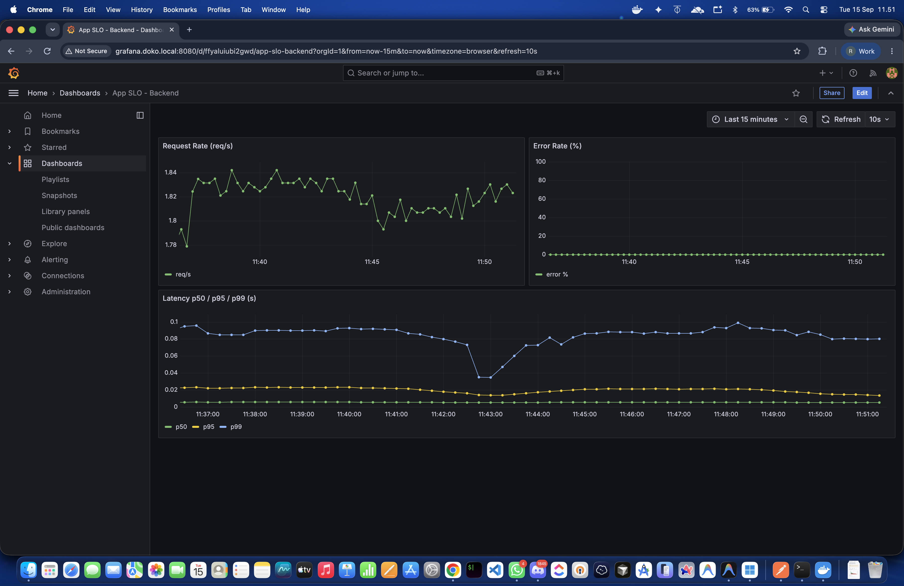
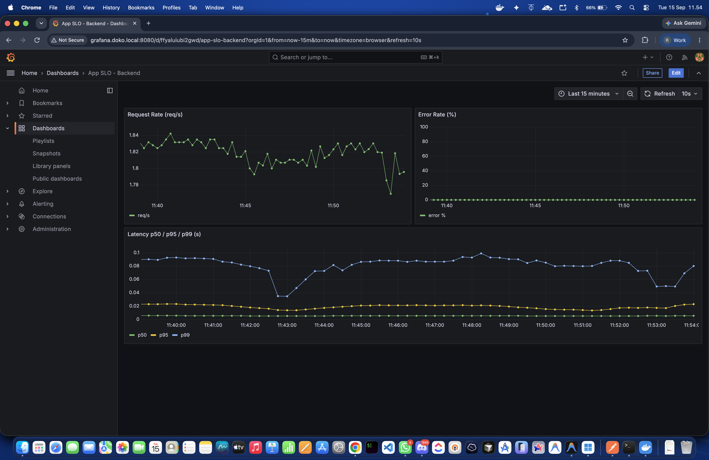

# Doko — Reliability Engineering Showcase

Aplikasi full-stack sederhana (React + Nginx, Bun/Express, PostgreSQL) yang
dipakai sebagai **medium untuk latihan reliability engineering end-to-end**:
deploy → observe → define SLO → break (chaos) → respond → automate — dijalankan
di atas Kubernetes (k3s/k3d), target akhir arm64 (STB homelab).

Proyek asalnya demo `docker-compose` biasa. Lapisan keandalan di bawah ini
ditambahkan bertahap TANPA mengubah app/test yang sudah ada — semuanya hidup
berdampingan di folder terpisah.

<p align="left">
  <a href="https://www.docker.com/" target="_blank" rel="noreferrer"></a>
  <a href="https://kubernetes.io/" target="_blank" rel="noreferrer"></a>
  <a href="https://k3d.io/" target="_blank" rel="noreferrer"></a>
  <a href="https://prometheus.io/" target="_blank" rel="noreferrer"></a>
  <a href="https://grafana.com/" target="_blank" rel="noreferrer"></a>
  <a href="https://react.dev/" target="_blank" rel="noreferrer"></a>
  <a href="https://bun.sh/" target="_blank" rel="noreferrer"></a>
  <a href="https://www.postgresql.org/" target="_blank" rel="noreferrer"></a>
  <a href="https://playwright.dev/" target="_blank" rel="noreferrer"></a>
  <a href="https://k6.io/" target="_blank" rel="noreferrer"></a>
</p>

---

## Cerita singkat: enam fase

| Fase | Apa yang dikerjakan | Bukti/hasil |
|---|---|---|
| 1. Deploy | Manifest k3s dasar (Deployment/Service/Ingress), Postgres ClusterIP-only | End-to-end jalan di k3d nyata — [`/k8s`](k8s/) |
| 2. Observe | Endpoint `/metrics` (prom-client) di backend, Prometheus + Grafana kedua di k8s | Scrape sehat, dashboard SLO otomatis — [`/observability`](observability/) |
| 3. Define SLO | Availability 99% / p99 < 500ms, recording+alerting multi-window multi-burn-rate (pola Google SRE Workbook) | 22 rule aktif, Alertmanager terhubung |
| 4. Harden | Readiness/liveness probe, resource limit, HPA — sekaligus **memperbaiki known issue** crash saat startup | Backend restart count turun dari 5-8x → **0** |
| 5. Break | 3 skenario chaos nyata: pod kill, CPU stress, network latency injection | MTTR 8 detik, 0% dampak availability — [`/postmortems`](postmortems/) |
| 6. Automate | README ini, dokumentasi mengalir | Kamu sedang membacanya |

Detail lengkap tiap fase (keputusan, file yang berubah, angka regression test)
ada di [`docs/PROJECT-STATUS.md`](docs/PROJECT-STATUS.md).

## Cerita tiap fase — apa yang dibuktikan, termasuk yang sempat salah

### Fase 3 — Define SLO: bug ditemukan sebelum sempat dipakai untuk keputusan nyata

SLO availability 99% / p99 < 500ms diterjemahkan jadi recording rule +
alerting multi-window multi-burn-rate (pola Google SRE Workbook). Saat
verifikasi, recording rule availability ternyata **selalu kosong (bukan 0)**
di sistem yang sehat — akibat perilaku PromQL `sum()` atas metrik yang belum
pernah punya sampel 5xx menghasilkan *empty vector*, bukan `0`. Tanpa fix
ini, rule-nya tidak akan pernah bisa dievaluasi benar di kondisi normal, dan
alert jadi tidak berguna justru saat sedang sehat. Diperbaiki dengan
`or vector(0)` sebelum alert ini pernah dipakai untuk keputusan nyata.

### Fase 4 — Harden: root cause fix, bukan patch di permukaan

Known issue "backend crash saat cluster k3d baru dibuat" ternyata bukan soal
urutan startup vs Postgres seperti dugaan awal — root cause-nya *unhandled
promise rejection* di `initializeDatabase()` kalau `pool.connect()` gagal.
Diperbaiki dengan retry loop tak terbatas (2 detik delay), diverifikasi lewat
restart count turun dari 5-8x jadi **0** di percobaan berulang.

**Future improvement** (belum dikerjakan, didokumentasikan saja): retry loop
tak terbatas simpel dan terbukti menghilangkan CrashLoopBackOff, tapi kurang
idiomatik untuk production — kalau Postgres down permanen, pod akan terlihat
"sehat" (Running, tidak restart) padahal tidak pernah bisa melayani trafik,
alih-alih gagal secara jelas. Dua alternatif yang lebih matang: (1)
**initContainer** yang menunggu Postgres reachable sebelum container utama
start (kegagalan terlihat jelas di status Pod, tapi startup jadi dua tahap);
atau (2) retry dengan **exponential backoff + max attempts** (pod akhirnya
`CrashLoopBackOff` kalau dependency benar-benar tidak pernah siap — trade-off
antara "restart count 0 selamanya" vs "kegagalan permanen tetap terlihat
sebagai gejala, bukan tersembunyi").

### Fase 5 — Break: tiga skenario chaos, semua benar-benar dijalankan

**Pod kill (3 replika)**: 150/150 request tetap sukses, pod pengganti siap
dalam 8 detik, dampak customer-facing nol — diverifikasi ulang 2x setelah
bug Fase 6 di bawah diperbaiki, hasilnya identik.
([postmortem](postmortems/2026-09-15-pod-kill.md))

| Sebelum | Sesudah (~15 detik setelah pod dihapus) |
|---|---|
|  |  |

Error Rate tetap flat 0% di kedua kondisi — bukti visual langsung dari klaim
"zero customer-facing impact" di atas, bukan cuma angka di postmortem.

**CPU stress** (`stress-ng`, 2 core/60s): 400/400 request tetap sukses,
latency p95 tetap di 135ms. ([postmortem](postmortems/2026-09-15-cpu-stress.md))

**Network latency injection**: menemukan bahwa load balancing Traefik+kube-proxy
di setup ini TIDAK round-robin murni per-request — cuma 1% traffic yang kena pod
bermasalah, bukan ~33% yang diasumsikan naif. Dicatat sebagai temuan, bukan
disembunyikan. ([postmortem](postmortems/2026-09-15-latency-injection.md))

### Fase 6 — Automate: bug kedua, ditemukan bukan lewat automated test

Saat menyiapkan dokumentasi (screenshot dashboard untuk README ini), angka
`Request Rate` di Grafana kelihatan janggal — naik ke 15 req/s padahal
traffic sebenarnya cuma ~2 req/s. **Ini ketahuan karena observasi manusia
langsung menatap dashboard secara interaktif, bukan dari automated test atau
query API sesaat** — semua verifikasi otomatis sebelumnya kebetulan tidak
menangkap anomali ini dengan jelas.

Root cause: Prometheus men-scrape lewat Service ClusterIP (`backend:8080`),
yang di-load-balance kube-proxy ke pod BERBEDA-BEDA tiap scrape — tiap pod
punya counter independen, jadi datanya loncat-loncat begitu replika backend
> 1 (rutin terjadi via HPA sejak Fase 4). Diperbaiki dengan Kubernetes
service discovery (scrape per-pod langsung by IP).

Karena bug ini berarti recording rule SLO Fase 3 berpotensi tidak akurat
saat postmortem Fase 5 ditulis, **ketiga skenario chaos diverifikasi ulang
pasca-fix** — hasilnya menarik: angka availability tetap konsisten (0% di
kedua pengukuran), tapi angka SLI latency (`slo:latency_bad:ratio_rate5m`)
naik signifikan pasca-fix di dua skenario (CPU stress: 0.66%→1.71%, latency
injection: 0.46%→2.31%) — pola arah yang sama mengindikasikan bug ini
kemungkinan secara sistematis **meremehkan** rasio "lambat", bukan cuma
noise acak. Kesimpulan kualitatif tiap postmortem tetap valid; angka lama
TIDAK ditimpa, dicatat berdampingan sebagai bukti nyata dampak bug. Detail
lengkap & perbandingan angka: [docs/PROJECT-STATUS.md](docs/PROJECT-STATUS.md).

---

## Menjalankan lewat Docker Compose (cara lama, tetap dipertahankan)

Cocok untuk pengembangan cepat tanpa Kubernetes.

### Prasyarat
- [Git](https://git-scm.com/), [Docker](https://www.docker.com/products/docker-desktop/) & Docker Compose
- [Node.js](https://nodejs.org/) (v18+) & npm, [Bun](https://bun.sh/) — hanya kalau mau jalankan/edit di luar container

### Jalankan

```bash
git clone https://github.com/Riyan117/doko-simple-fullstack.git
cd doko-simple-fullstack
docker compose up -d --build
```

- **Frontend**: http://localhost
- **API**: http://localhost:8080/api/hello
- **Grafana (k6/InfluxDB)**: http://localhost:3000 (login `admin`/`admin`)

### Testing

```bash
docker compose run --rm playwright   # E2E
docker compose run --rm k6           # Load test
```

### Matikan

```bash
docker compose down
```

---

## Menjalankan lewat k3s/k3d (reliability stack lengkap)

Butuh `k3d`, `kubectl`, dan `kubeconform` (opsional, untuk validasi skema).

```bash
k3d cluster create doko --port "8080:80@loadbalancer"
docker build -t doko-backend:local ./backend
docker build -t doko-frontend:local ./frontend
k3d image import doko-backend:local doko-frontend:local -c doko

kubectl apply -f k8s/
kubectl apply -f observability/
```

Tambahkan ke `/etc/hosts`: `127.0.0.1 doko.local` dan `127.0.0.1 grafana.doko.local`,
lalu buka `http://doko.local:8080` (app) dan `http://grafana.doko.local:8080`
(dashboard SLO — bukan dashboard k6, itu tetap di docker-compose).

Langkah lengkap + penjelasan tiap manifest: [`k8s/README.md`](k8s/README.md) dan
[`observability/README.md`](observability/README.md).

### Coba chaos experiment sendiri

```bash
./chaos/01-pod-kill.sh
./chaos/02-cpu-stress.sh
./chaos/03-latency-injection.sh inject   # lalu: ./chaos/03-latency-injection.sh remove
```

---

## Struktur Proyek

```
doko-simple-fullstack/
├── backend/            # Express/Bun + endpoint /metrics, /healthz/{live,ready}
├── frontend/            # React + Nginx (docker-compose)
├── grafana/              # Provisioning Grafana docker-compose (dashboard k6/InfluxDB)
├── k6/                    # Skenario load test
│
├── k8s/                   # Fase 1+4: Deployment/Service/Ingress/HPA dasar
├── observability/         # Fase 2+3: Prometheus, Grafana (app SLO), Alertmanager, SLO rules
├── chaos/                 # Fase 5: skenario chaos (pod-kill, cpu-stress, latency-injection)
├── postmortems/           # Fase 5: postmortem blameless berisi data nyata
├── docs/                  # PROJECT-STATUS.md (log tiap fase), regression-baseline.md
│
└── docker-compose.yml     # Stack asli, tidak pernah diubah sepanjang proyek ini
```

## Prinsip yang dipegang sepanjang proyek

- **Tidak pernah merusak yang sudah jalan.** `docker-compose.yml`, Dockerfile asli,
  `nginx.conf`, test Playwright, dan skrip k6 tidak pernah diubah — semua penambahan
  hidup di folder terpisah.
- **Regression gate di tiap perubahan kode app.** Playwright + k6 dijalankan ulang
  dan dibandingkan ke baseline setiap `server.js` berubah.
- **Sumber kebenaran SLO = Prometheus di cluster**, bukan k6 di laptop — angka
  latency dari load test lokal cuma data poin, bukan klaim.
- **Ringan dulu, berat belakangan.** Static scrape config alih-alih Prometheus
  Operator, `tc netem` alih-alih Chaos Mesh — semua demi target akhir jalan di
  STB arm64 dengan RAM terbatas.
